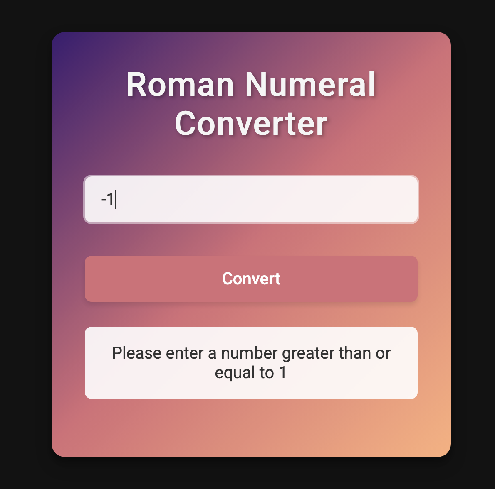
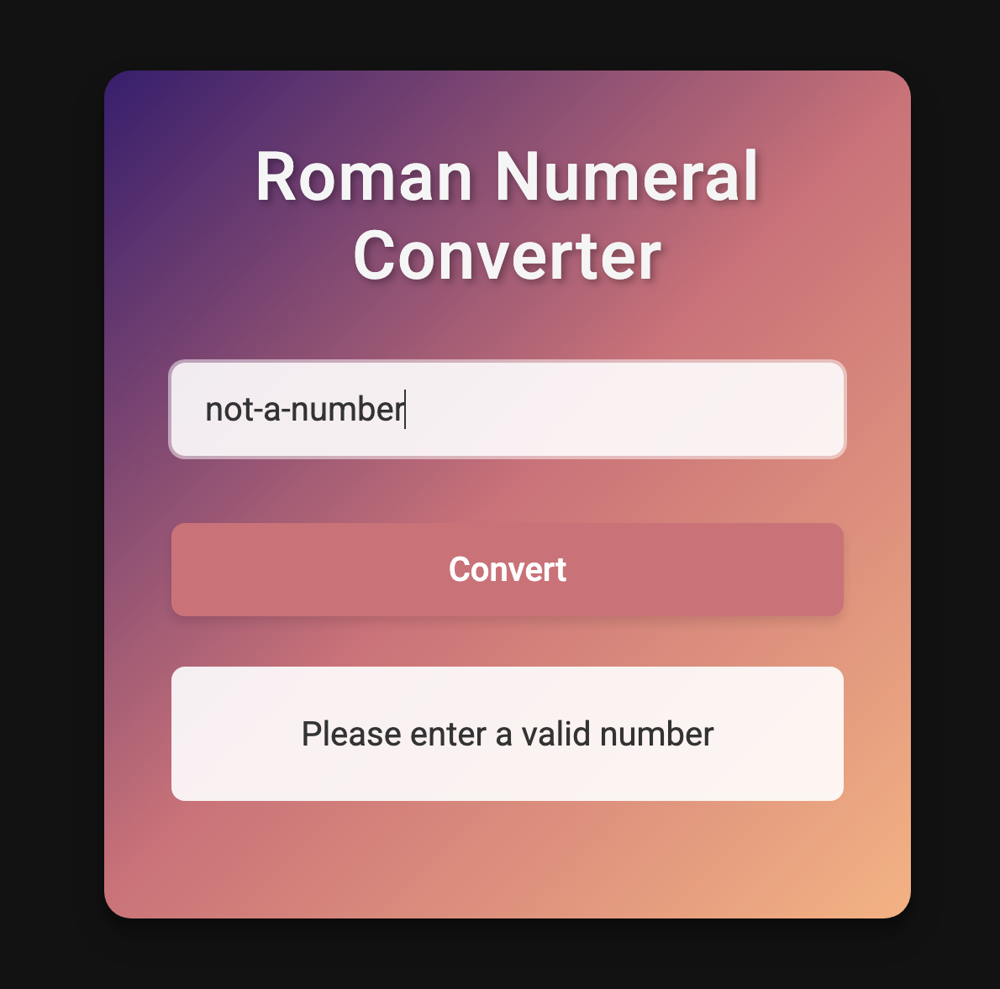

# Roman Numeral Converter

A sleek web application that converts decimal numbers to Roman numerals. This project was developed as part of the **freeCodeCamp JavaScript Algorithms and Data Structures Certification**.

## Screenshots

|  Main Application |  Error: Non-numeric Input |  Error: Zero Not Valid |
|:----------------:|:----------------:|:----------------:|
|  Error: Negative Number |  Error: Number Exceeds 3999 |  Successful Conversion |

## Features

- Convert any number from 1 to 3999 to Roman numerals
- Clean, responsive design with a gradient background
- Input validation with helpful error messages
- Simple and intuitive user interface

## How It Works

The application accepts a number input from the user and converts it to its equivalent Roman numeral representation following these rules:

- Roman numerals are represented by seven different symbols: I, V, X, L, C, D and M.
- Numbers are formed by combining symbols and adding their values.
- Special subtractive combinations like IV (4) and IX (9) are handled automatically.
- The application supports numbers from 1 to 3999.

## Input Validation

The application validates input and provides helpful error messages for:
- Invalid inputs (non-numeric values)
- Zero (not represented in Roman numerals)
- Negative numbers
- Numbers greater than 3999

## Algorithm

The conversion algorithm works by:
1. Breaking down the input number into individual digits
2. Converting each digit to its Roman numeral representation
3. Handling special cases like 4, 9, 40, 90, etc. using the subtractive principle
4. Combining all parts to form the final Roman numeral

## Technologies Used

- HTML5
- CSS3 (with custom gradient background)
- JavaScript (Vanilla JS)
- Google Fonts (Roboto)

## Certification Project

This Roman Numeral Converter is one of five projects I completed to earn the [JavaScript Algorithms and Data Structures Certification](https://www.freecodecamp.org/certification/jili0/javascript-algorithms-and-data-structures-v8) from freeCodeCamp.

### Other Certification Projects

The certification required building the following projects with all test suites passing:

- Palindrome Checker
- Roman Numeral Converter (this project)
- Telephone Number Validator
- Cash Register
- Pokémon Search App

You can view all these projects by visiting my certification link above.